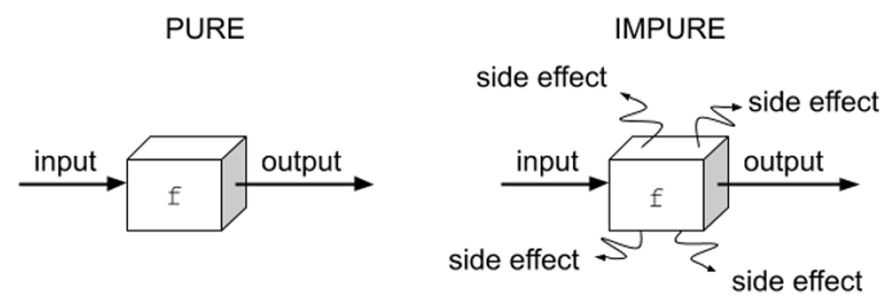

```js
function shuffle(list) {
  let _ = [...list];
  for (let i = _.length - 1; i > 0; --i) {
    let k = Math.floor(Math.random() * (i + 1));
    [_[k], _[i]] = [_[i], _[k]]; // 위치를 바꾸는 것!
  }
  return _;
}

const A = [1, 2, 3];
const B = shuffle(A);

console.assert( // 거짓이면 출력한다.
	Object.is(A, B), // 같은 객체인지 확인하는 boolean return
	`:-( 다른 배열이에요.`
)
```

1. Vue.js React는 모두 Virtual Dom를 사용한다.

```js
// 대충 이러한 것을 h(hyperscript)로 불러와서 사용한다.
function createElement(type, props, ...children) {
  return {
    $$typeof: Symbol('virtual-element'),
    key: null,
    type,
    props: { ...props, children: [...(props.children ?? []), ...children] },
  };
}
```

- 장점  
  - 효율적인 업데이트: 가상 DOM은 변경된 부분만 감지하여 업데이트하므로, 모든 요소를 다시 렌더링하지 된다. 성능 향상
  - 추상화: 가상 DOM은 실제 DOM의 추상화 계층을 제공하여 더 간단한 인터페이스로 작업할 수 있다.
  - 플랫폼 독립성: 가상 DOM은 웹 브라우저에 종속되지 않으므로, 웹, 서버, 네이티브 모바일 등 다양한 플랫폼에서 동일한 개발 방식을 사용할 수 있다.
  - 개발자 경험 개선: 가상 DOM은 컴포넌트 기반 접근 방식을 채택하고 있어 재사용성과 유지보수성을 가진다.

2. 자바스크립트에서 `import`를 사용하려면 해당 파일의 해당 항목에 `export`가 제시되어 있어야 한다.  

> ※ 모듈에 대해서 공부하자!  
- <a href="https://ko.javascript.info/modules-intro">https://ko.javascript.info/modules-intro</a>  
- <a href="https://ko.javascript.info/import-export">https://ko.javascript.info/import-export</a>


>  `script`에서 `src`가 있다면 태그 내의 내용은 무시된다.  


`export`: 이름으로 내보내기 -> `as`를 통해 이름 변경 가능    

```js
import { ftn } from './file.js'
```

`export default`: 기본 내보내기  

```js
import ftn from './file.js'
```

※ 아무것도 없다면: 외부에서 접근할 수 없는 것!  

<hr>  

- 클래스에서 #으로 시작하는 변수나 메서드는 private
- 스태틱 메서드는 자바에서 스태틱 메서드와 비슷한 것으로 생각되며, 그렇지 않은 것은 istance 메서드이다.
- 웹 환경이 아닌 IDE에서 자바스크립트를 import 하려면 `package.json` 에 `type="module"`을 추가해야 한다.


<hr>

> functional Programming   

함수형 프로그래밍  
- 프로그래밍 패러다임 중 하나로, <b>프로그래밍을 함수들의 조합으로 바라보는 것</b>
  - 가독성, 재사용성, 유지보수 up  

<br>  




프로그래밍 패러다임  
<a href="https://hyperskill.org/learn/step/15860">https://hyperskill.org/learn/step/15860</a>

- 명령형 프로그래밍(Imperative Programming)  
- 선언형 프로그래밍(Declarative Programming)  

<br>  

> 함수형 프로그래밍의 핵심 원칙  
- 각 함수가 한 가지 작업을 제대로 수행하는지 확인하는 데 중점  
- 사용하는 이유: 읽기 쉽고, 간결하고, 유지 관리가 용이하며 테스트하기에 좋다.
- JavaScript 프로그래밍 패러다임  
  - 함수형 프로그래밍  
    - 함수 중심 설계
    - immutable
    - 적은 데이터 구조  
    - 사이드 이펙트가 없는 함수  
  
  - 객체 지향 프로그래밍  
    - mutable
    - 많은 데이터 구조  
    - 사이드 이펙트를 포함하는 메서드  

<br>  

> 사이드 이펙트  
- 순수 함수는 부수 효과를 포함해서는 안된다.  
  - input 입력 및 변경  
  - DOM 쿼리 및 업데이트  
  - 네트워크 API 호출  
  - 로깅(logging)
  - 파일 읽기 / 쓰기  
  - 글로벌 상태 읽기  

<br>  

> JavaScript 빌트인 함수  
- map method  
- filter method  
- reduce method  
- flat method  

<br>  

> 함수형 프로그래밍, 중급 개념  
- 재귀  
- 고차 함수  
- 커링(Currying): 함수를 선언할 때, 모든 인수를 한 번에 받는 대신, 하나의 인수만 받고, 이어서 다음 함수를 반환하도록 하는 것  

<br>  

> 함수 컴포지션  
- Ramda 라이브러리: <a href="https://ramdajs.com/">https://ramdajs.com/</a>  
- Lodash 라이브러리: <a href="https://lodash.com/">https://lodash.com/</a>


<hr>

# React  

1. React는 mutable(가변) data를 허용하지 않는다.  
