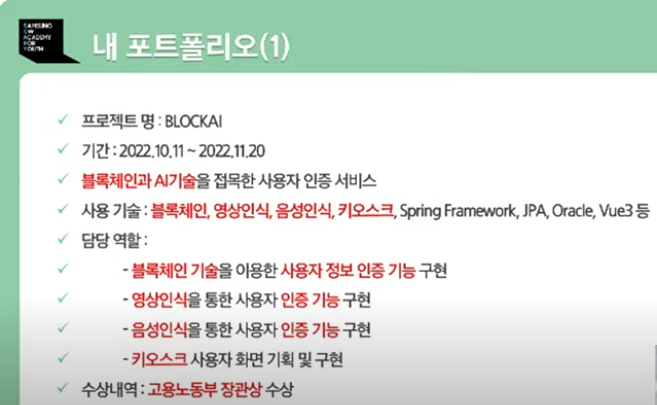
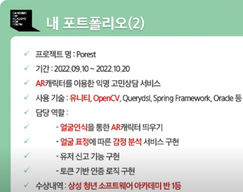
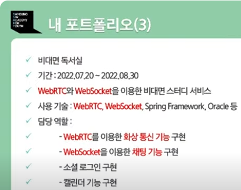

### 프로젝트에서는 무엇을 보여주어야 하는가?
- 기술적인 요소 + 서비스적인 요소
- 개발자로서 얼마나 많은 기술적인 요소를 보여줄 수 있나?
- 기술의 개수가 아닌 기술의 수준
- 우리가 선택한 주제의 특징을 얼마나 잘 살렸는가?

### 다양한 기술들
- OpenCV
- WebRTC
- block chain
- hadoop
- tensorflow

### 프론트엔드와 백엔드 개발
- 프론트엔드 개발자에게 중요한 것은 무엇일까?
  - 기획자 또는 사용자가 원하는 기능을 '좋은 성능'과 유지보수가 쉬운 '효율적인 구조'로 설계하고 개발하는 능력
- 백엔드 개발자에게 중요한 것은 무엇일까?
  - 기획자 또는 사용자가 원하는 기능을 '좋은 성능'과 유지보수가 쉬운 '효율적인 구조'로 설계하고 개발하는 능력

### 내 포트폴리오

### 포트폴리오 상세
- 와이어 프레임, 기능 상세 설명 등
- 기능 구현에 사용된 기술, 알고리즘에 대한 설명
- UCC
- GIT 등

### 프로젝트의 목표 설정
- 면접관이 내 포트폴리오를 10분 이상 보도록 만들자.  

